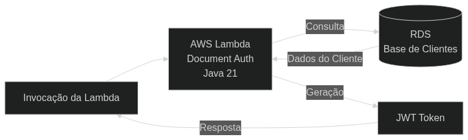

# 📦 Document Auth Lambda Service

Este projeto contém uma função AWS Lambda escrita em **Java 21** para processamento de autenticação de cliente pelo documento. A infraestrutura é gerenciada como código via **Terraform** e o deploy é automatizado através de **GitHub Actions**.

---

## 🔑 Regras de Negócio e Autenticação

A função Lambda é responsável pela autenticação do cliente com base em seu documento:

1. **Validação:** O sistema verifica se o documento informado existe e se o cliente está com o status **Ativo** na base de dados.
2. **Token JWT:** Caso a validação seja bem-sucedida, a Lambda retorna um **JWT (JSON Web Token)**.
3. **Fluxo Seguinte:** Este token deve ser utilizado obrigatoriamente para autenticar as chamadas nos endpoints de **Aceite** ou **Recusa** da Ordem de Serviço.

---

## 🧭 Diagrama da Arquitetura

---

## 🔁 CI/CD

O deploy da infraestrutura (Terraform) e da função Lambda (Java) é realizado
automaticamente via **GitHub Actions**, conforme a branch de destino:

- `homologation` → Ambiente de Homologação
- `main` → Ambiente de Produção

🔗 Pipeline: https://github.com/challenger-pos/lambda-function-serverless/actions

---

## 🛡️ Regras do Repositório (Desafio)

- **Branch main:** Protegida. Commits diretos são proibidos; o uso de Pull Requests é obrigatório.
- **Merge Flow:** O fluxo recomendado é `develop` -> `homologation` -> `main`.
- **Deploy Automático:** Configurado via GitHub Actions para disparar em `homologation` e `main` (Production).

---

## 🧭 Estrutura do Projeto

- `DocumentAuthFunction/` — Código-fonte da função Lambda (Java/Maven).
- `infra/terraform/` — Código da infraestrutura AWS (Terraform).
- `.github/workflows/` — Pipeline de CI/CD (GitHub Actions).

---

## ✨ Tecnologias
- **Java 21**
- **Maven 3.9+**
- **Terraform 1.9.7**
- **GitHub Actions**

---

## 🔨 Desenvolvimento Local (Ambiente Develop)

### 1. Build do Código (Java)
Para compilar e gerar o artefato JAR (Fat JAR) que será enviado para a AWS:

1. Acesse a pasta: `cd DocumentAuthFunction`
2. Execute o build: `mvn clean package -DskipTests`

O Maven gerará o arquivo final no diretório `DocumentAuthFunction/target/`.

### 2. Validação da Infraestrutura (Terraform)
Você pode simular o que a pipeline fará localmente:

1. Acesse a pasta: `cd infra/terraform`
2. Inicialize: `terraform init -backend-config="key=v4/lambda/dev/terraform.tfstate"`
3. Planeje: `terraform plan -var="environment=dev" -var="aws_region=us-east-2" -var="db_password=SUA_SENHA"`

---

## 🚀 CI/CD e Gestão de Ambientes

O deploy é disparado automaticamente conforme a branch de destino. A pipeline utiliza variáveis de ambiente para isolar os estados no S3:
- **Push para `homologation`:** Deploy automático no ambiente de Homologação.
- **Push para `main`:** Deploy automático no ambiente de Produção.

| Branch | Ambiente | Estado no S3 (Key) |
| :--- | :--- | :--- |
| `main` | **production** | `lambda/production/terraform.tfstate` |
| `homologation` | **homologation** | `lambda/homologation/terraform.tfstate` |

---

## ❗ Observações Importantes

1. **Isolamento:** Todos os recursos no Terraform utilizam o sufixo `${var.environment}` nos nomes.
2. **Runtime:** A função utiliza o runtime **Java 21** da AWS Lambda.

---

## 🧪 Monitoramento
- **Logs:** CloudWatch Logs sob o grupo `/aws/lambda/<nome-da-funcao>-<ambiente>`.
- **Métricas:** Invocação e erros disponíveis no CloudWatch Metrics.